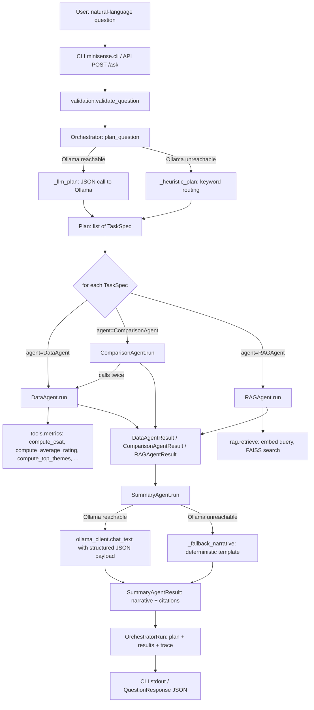
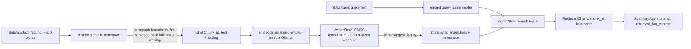

# MiniSense — Technical Review & Submission Report

This document is the single reviewer-facing technical writeup for the MiniSense
take-home assessment. It is grounded entirely in the actual code in this
repository — every schema, code path, and example below was read directly
from source or captured from a real local run (Ollama `llama3.1:8b` +
`nomic-embed-text`, 100,000-record dataset). Nothing here is invented.

Status labels used throughout: **IMPLEMENTED**, **PARTIALLY IMPLEMENTED**,
**DESIGNED BUT NOT IMPLEMENTED**, **NOT IMPLEMENTED**, **OPTIONAL/FUTURE**.

---

## 1. Executive summary

MiniSense is a two-level multi-agent system: an `Orchestrator` (planner) that
turns a natural-language business question into a structured `Plan` of
`TaskSpec`s, routes each to one of four sub-agents (`DataAgent`, `RAGAgent`,
`ComparisonAgent`, `SummaryAgent`), and returns a narrative answer plus a full
execution trace. Planning and narrative synthesis go through a local Ollama
model; every numeric computation (CSAT, average rating, theme counts, period
deltas) is plain deterministic Python, never delegated to the LLM. The FAQ is
retrieved via a from-scratch FAISS-backed RAG pipeline (sentence-aware
chunking, `nomic-embed-text` embeddings). All four assessment sub-agents from
the brief are implemented (the brief requires at least two), and both
required parts (multi-agent pipeline, RAG pipeline) plus the fine-tuning
design writeup are present in `README.md`.

**Verdict: READY FOR SUBMISSION**, with the gaps noted in §11 (Reviewer
Assessment) called out explicitly rather than hidden.

---

## 2. Actual architecture



This is the real control flow in `agents/orchestrator.py::answer_question`
and `plan_question` — not a proposed design. Note there is no
`ComparisonAgent → SummaryAgent` fan-in step distinct from `DataAgent`'s: the
orchestrator collects at most one result per agent type into
`OrchestratorRun` and hands all three (any of which may be `None`) to
`SummaryAgent.run` in one call.

---

## 3. End-to-end workflow — real worked example

Question actually run against the live system (100,000-record dataset,
`llama3.1:8b` planner/summarizer): **"What are the top 3 complaints this month
and how do they compare to last month?"**. Full output is committed at
`outputs/eval_results.md` (Q1); the stages below cite the exact code that
produced it.

| Stage | Component | Input | Processing | Output |
|---|---|---|---|---|
| 1 | `validation.validate_question` | raw question string | non-empty + length check (`API_MAX_QUESTION_CHARS`) | validated string or `InvalidQuestionError` |
| 2 | `orchestrator.plan_question` | question, all responses | checks `ollama_client.is_available()` | routes to `_llm_plan` or `_heuristic_plan` |
| 3 | `orchestrator._llm_plan` | question + `business_index` (name→id map) | one `chat_json` call to Ollama with `PLANNER_SYSTEM_PROMPT`, today anchored to `_dataset_today(responses)` (max date in the dataset, **not** wall-clock — see §9, Decision 4) | `Plan(reasoning=..., tasks=[TaskSpec, TaskSpec])` |
| 4 | Orchestrator loop | each `TaskSpec` | dispatches on `task.agent` | calls `data_agent.run` then `comparison_agent.run` |
| 5 | `data_agent.run` | `TaskSpec(period_a=<this month>)`, all responses | `tools.filter_responses` by date range → `tools.metrics.compute_*` | `DataAgentResult(response_count=54143, average_rating=3.645, csat_pct=62.13, top_themes=[...])` |
| 6 | `comparison_agent.run` | `TaskSpec(period_a=last month, period_b=this month)` | calls `data_agent.run` twice internally, diffs every metric + **all** theme counts (not just top-3, see §9 Decision 5) | `ComparisonAgentResult(deltas=[...], theme_shifts=["wait time mentions up 99% (2137 -> 4248)", ...])` |
| 7 | `summary_agent.run` | question + both structured results (RAG absent for this question) | one `chat_text` call with `SYSTEM_PROMPT` instructing "use only these numbers" | `SummaryAgentResult(narrative="This month, customers have been complaining about wait times, with 4,248 mentions...")` |
| 8 | `answer_question` | all of the above | assembles `AgentRunLog` trace entries | `OrchestratorRun(plan, data_result, comparison_result, rag_result, summary, trace)` |
| 9 | CLI/API | `OrchestratorRun` | `cli.py` prints plan+answer; `api.py::ask` maps to `QuestionResponse` | user-facing text / JSON |

The captured real narrative (verbatim, from `outputs/eval_results.md`):

> "This month, customers have been complaining about wait times, with 4,248
> mentions, followed by staff issues with 4,234 mentions, and food quality
> concerns with 4,221 mentions. Compared to last month, food quality
> complaints have increased by 27% and wait time complaints have skyrocketed
> by 99%. [...] It's worth noting that none of these changes are significant
> enough to trigger our policies for corrective action, but it's still worth
> keeping an eye on these trends."

Note the last sentence is an LLM inference from the structured `is_significant`
flags in `ComparisonAgentResult.deltas` (correctly none were `True` for the
rating/CSAT/count deltas here) — a real example of the model reasoning over
exact numbers rather than inventing them.

---

## 4. Agent responsibilities

| Component | Status | Responsibility | File | Why separate |
|---|---|---|---|---|
| Orchestrator | **IMPLEMENTED** | NL question → `Plan` → dispatch → aggregate → delegate to SummaryAgent | `agents/orchestrator.py` | Single place that owns routing/aggregation logic |
| DataAgent | **IMPLEMENTED** | Filter dataset, compute exact metrics via `tools/metrics.py` | `agents/data_agent.py` | Deterministic computation isolated from LLM reasoning |
| RAGAgent | **IMPLEMENTED** | Embed query, FAISS top-k retrieval over FAQ chunks | `agents/rag_agent.py` | Retrieval/grounding isolated from computation and synthesis |
| ComparisonAgent | **IMPLEMENTED** | Two-period diff via two `DataAgent` calls + significance thresholds | `agents/comparison_agent.py` | Comparison logic reuses DataAgent rather than duplicating filtering |
| SummaryAgent | **IMPLEMENTED** | Structured results → one narrative paragraph, with deterministic fallback | `agents/summary_agent.py` | Only component that touches free-form generation |

All four sub-agents from the assessment's list are implemented (brief requires
≥2).

---

## 5. Structured contracts (real schemas, `schemas.py`)

Orchestrator → sub-agent (never raw text):

```python
@dataclass
class TaskSpec:
    agent: AgentName                    # DataAgent | RAGAgent | ComparisonAgent | SummaryAgent
    objective: str
    business_id: str | None = None
    period_a: DateRange | None = None
    period_b: DateRange | None = None   # ComparisonAgent only
    query_text: str | None = None       # RAGAgent only
    top_k: int = 4
    metrics: list[str] = field(default_factory=list)
```

Sub-agent → orchestrator (typed dataclasses, never free text except
`SummaryAgentResult.narrative` itself):

```python
@dataclass
class DataAgentResult:
    period: DateRange
    business_id: str | None
    response_count: int
    average_rating: float | None
    csat_pct: float | None
    top_themes: list[ThemeCount]
    channel_breakdown: dict[str, int]

@dataclass
class ComparisonAgentResult:
    period_a: DateRange
    period_b: DateRange
    deltas: list[MetricDelta]           # metric, both values, abs/pct change, is_significant
    theme_shifts: list[str]

@dataclass
class RAGAgentResult:
    query: str
    chunks: list[RetrievedChunk]        # chunk_id, text, score
```

`SurveyResponseRecord` (pydantic, not a dataclass — it's the untrusted-input
validation boundary in `data_loader.load_responses`, distinct from the
internal agent-to-agent dataclass contracts above).

---

## 6. Tool calling (assessment-required example)

```
DataAgent.run(task, responses)
    -> tools.filter_responses(responses, business_id, start, end)
    -> tools.compute_response_count(filtered)
    -> tools.compute_average_rating(filtered)
    -> tools.compute_csat(filtered, threshold=4)          # required example
    -> tools.compute_top_themes(filtered, top_n=3)
    -> tools.compute_channel_breakdown(filtered)
    -> DataAgentResult(...)
```

`compute_csat` (`tools/metrics.py:78-83`):

```python
def compute_csat(responses: list[Response], threshold: int = 4) -> float | None:
    if not responses:
        return None
    satisfied = sum(1 for r in responses if r["rating"] >= threshold)
    return round(100.0 * satisfied / len(responses), 2)
```

- **Input**: a list of already-filtered response dicts, `threshold` (default 4).
- **Output**: `float | None` — percent of responses rated ≥ threshold, or
  `None` for an empty period.
- **Caller**: `data_agent.run` (`agents/data_agent.py:33`), called directly
  (not routed through the LLM's function-calling API — see Decision 1 below).
- **Why deterministic over LLM-computed**: an LLM asked to "calculate CSAT
  from these 54,143 rows" would either need the full dataset in-context
  (expensive, lossy) or hallucinate an approximate figure; a pure function
  is exact, testable (`tests/test_metrics.py`), and free.
- **Incorporation**: the returned float becomes `DataAgentResult.csat_pct`,
  which flows unmodified into `SummaryAgent`'s prompt payload — the LLM
  narrates the number, never recomputes it.

This is real tool calling *within* an agent in the sense the assignment
describes (a Python function the agent invokes for a sub-computation), not
LLM-native function-calling (no OpenAI/Anthropic tool-use JSON schema is
used anywhere — Ollama's `chat_json` is used only for the planner's
structured *output*, not for tool invocation). Labeling this precisely:
**IMPLEMENTED** as "agent calls a deterministic tool function"; **NOT
IMPLEMENTED** as "LLM-native function-calling protocol" (not required by the
assessment, which explicitly accepts "plain Python" as one of the allowed
approaches).

---

## 7. RAG pipeline (real implementation)



- **Chunking** (`rag/chunking.py`): paragraph-boundary-first, sentence-pack
  fallback with overlap. `CHUNK_MAX_CHARS=500`, `CHUNK_OVERLAP_CHARS=80`
  (`.env.example` defaults). Justification is in the module docstring and
  README §7: the FAQ is Q/A pairs under markdown headings, so paragraph
  chunking keeps each Q/A pair intact rather than splitting mid-sentence.
  Actual run: 12 chunks from the ~500-word FAQ.
- **Embeddings**: `nomic-embed-text` via the local Ollama server
  (`llm/ollama_client.embed`), not an external API.
- **Vector store** (`rag/vector_store.py`): FAISS `IndexFlatIP` over
  L2-normalized vectors (cosine similarity); falls back to a NumPy
  brute-force matrix multiply if `faiss` isn't importable — irrelevant here
  since `faiss-cpu` is installed, but keeps the assignment's "or similar"
  language honest.
- **Retrieval**: `rag/retrieve.py::retrieve(query, top_k)` — top-k defaults
  to `TaskSpec.top_k=4`.
- **Integration**: `RAGAgentResult.chunks` text is placed into
  `SummaryAgent`'s `retrieved_faq_context` list in the same JSON payload as
  `DataAgentResult`/`ComparisonAgentResult` — one prompt, both sources,
  exactly as the assignment's Part 2 step 3 specifies.
- **Persistence**: `scripts/ingest_faq.py` builds the index once;
  `storage/faq_index.faiss` + `.meta.json` are reused across runs (not
  rebuilt per-query — see §10 Performance).

### RAG evaluation (3 required sample questions)

Full detail with actual retrieved chunks and final answers:
**`outputs/eval_results.md`** (committed, generated by
`scripts/eval_questions.py`, real Ollama run against the 100k dataset).
Summary:

| # | Question | Retrieval outcome |
|---|---|---|
| 1 | Top 3 complaints this month vs last month | No RAG task routed (pure DataAgent+ComparisonAgent question) |
| 2 | Overall CSAT vs stated target | Top-1 chunk (`chunk_007`, score 0.680) is the exact CSAT-target Q/A; correctly grounds the "4.5+ target" claim in the narrative |
| 3 | Average wait time vs policy | Top-1 chunk (`chunk_004`, score 0.697) is the exact wait-time Q/A |

Retrieval strengths/limitations (from the file, unedited): works well when a
question maps to a single FAQ heading (sentence-aware chunking keeps each
Q/A pair whole, so top-1 is almost always right); falls short on questions
needing synthesis across multiple FAQ sections, where connecting chunks into
one causal story is left to the LLM rather than retrieval itself; the FAQ's
small size (~500 words, 12 chunks) means there's little headroom to observe
retrieval failing outright.

---

## 8. Failure handling (actual behavior, not aspirational)

| Case | Actual behavior | Evidence |
|---|---|---|
| Ollama unreachable at planning time | Falls back to `_heuristic_plan` (keyword routing: "compare"/"vs"/"last month" → comparative) | `orchestrator.py::plan_question` |
| Ollama unreachable at summary time | Falls back to `_fallback_narrative` (deterministic template) | `summary_agent.py::run` |
| Ollama becomes unavailable *mid*-summary call | Caught (`OllamaUnavailableError`), falls back to template | `summary_agent.py:97-99` |
| FAQ index not built yet | `RAGAgent` raises `IndexNotFoundError`; orchestrator catches it, logs a warning, continues without RAG | `orchestrator.py:189-204` |
| Malformed/invalid survey record | Skipped individually with a logged reason; only fails hard if **every** record is invalid | `data_loader.py::_validate_records` |
| Empty/missing survey JSON | `DataLoadError` → FastAPI 503, CLI exits with error | `data_loader.py::_read_json`, `api.py::_data_load_error_handler` |
| Empty/oversized question | `InvalidQuestionError` → FastAPI 400 | `validation.py`, `api.py::_invalid_question_handler` |
| Unhandled exception | Logged in full server-side; client gets a generic 500, no internal detail leaked in production | `api.py::_unhandled_exception_handler` |
| Agent timeout / retry | **NOT IMPLEMENTED** — a single Ollama call either returns within `MINISENSE_LLM_TIMEOUT` (120s default) or raises; there is no retry logic | `llm/ollama_client.py` (timeout only, `requests` raises on expiry) |
| LLM returns malformed JSON for the plan | Caught as `ValueError`/`KeyError` in `plan_question`, falls back to heuristic | `orchestrator.py:151-157` |

---

## 9. Design decisions

| # | Decision | Alternative considered | Why rejected | Trade-off |
|---|---|---|---|---|
| 1 | Deterministic Python for every numeric metric (`tools/metrics.py`), never LLM-computed | Ask the LLM to read/aggregate rows itself | LLMs are unreliable at exact arithmetic over thousands of rows and can't be unit-tested the same way | Requires writing/maintaining explicit tool functions, but numbers are exact and reproducible every run |
| 2 | Plain Python + one direct Ollama REST client, no LangChain/LangGraph | LangGraph/LangChain | Framework overhead not justified at this scope (5 agents, 1 LLM provider); explicit code is easier to review for a take-home | Would need to hand-roll multi-provider abstraction if requirements grew |
| 3 | Heuristic keyword fallback planner when Ollama is down | Fail the whole request | Assignment says the system should be "demonstrable with zero setup"; a heuristic keeps the pipeline runnable end-to-end without any model | Heuristic routing is less precise than LLM planning (keyword-based, e.g. "last month" triggers ComparisonAgent) |
| 4 | "This month"/"last month" anchored to `max(date)` in the loaded dataset, not `datetime.now()` | Use wall-clock `date.today()` (the code's first version) | The dataset is a fixed two-month demo window (April–May 2026); wall-clock anchoring silently returns zero rows whenever the system is run outside that window, which is a real bug caught during this session's local run | None significant — this is strictly more correct for a static demo dataset; a production system ingesting live data would use wall-clock time instead |
| 5 | ComparisonAgent recomputes **all** theme counts (`ALL_THEMES_TOP_N=100`) rather than diffing `DataAgentResult.top_themes` (top-3) | Diff the top-3 lists directly | A theme just outside the top 3 in one period but not the other would show a false "100% drop" | Slightly more computation (one extra `compute_top_themes` call per period), but correctness matters more here |
| 6 | Sentence-aware/paragraph-first chunking over fixed-size windows | Fixed-size character chunks | FAQ is short, structured Q/A; fixed windows would split a question from its answer mid-sentence | Would need re-evaluation on a larger, less structured corpus |
| 7 | FAISS `IndexFlatIP` (exact search) over an ANN index (HNSW/IVF) | Approximate nearest-neighbor index | Corpus is ~12-20 chunks; exact search is instant and simpler, ANN's speed advantage is irrelevant at this scale | Would not scale as-is to a large multi-document corpus |
| 8 | Embeddings via Ollama's `nomic-embed-text` rather than a separate `sentence-transformers` download | `sentence-transformers` / HuggingFace embedding model | Keeps the entire system on one local runtime (Ollama) with zero other model-download paths | Ties embedding quality to whatever Ollama's `nomic-embed-text` build provides |
| 9 | `pydantic-settings` `Settings` fails fast at startup on unsafe config (e.g. production with no `API_AUTH_TOKEN`) | Validate lazily per-request | Catches misconfiguration at process start, not three calls deep into a request | None significant |

---

## 10. Testing review

Actual test files (`tests/`, 57 tests total per README, offline/no-Ollama):

`test_api.py`, `test_chunking.py`, `test_cli.py`, `test_comparison_agent.py`,
`test_config.py`, `test_data_loader.py`, `test_metrics.py`,
`test_orchestrator.py`, `test_vector_store.py`.

Covered: metric functions (`compute_csat` etc.), chunking edge cases, vector
store add/search/persist round-trip, config validation, survey record
validation, heuristic planner routing (`test_orchestrator.py`), comparison
delta/significance logic, CLI argument handling, FastAPI routes (auth, rate
limit, `/health`, `/ready`, validation) via `TestClient`.

**Gaps** (no file for these — genuinely missing, not hidden):
- No dedicated `test_data_agent.py` (covered only indirectly through
  `test_orchestrator.py`'s heuristic-plan tests, which don't assert on
  `DataAgentResult` contents).
- No dedicated `test_rag_agent.py` or `test_summary_agent.py` (RAG is tested
  at the `chunking`/`vector_store` layer, not at `RAGAgent.run`; summary
  fallback template has no direct unit test).
- No integration test that drives `answer_question` end-to-end against a
  small fixture dataset with Ollama mocked (all Ollama-touching paths are
  exercised only via the CLI/API tests calling into fallback behavior, per
  the README's own note in §3).

**Recommended highest-value additions**: a fixture-based
`test_data_agent.py`/`test_rag_agent.py` asserting exact `DataAgentResult`/
`RAGAgentResult` field values for a known small dataset, and one
`answer_question`-level integration test with `ollama_client` mocked to
return canned JSON — this would catch orchestrator/schema wiring bugs (like
the `date.today()` issue in Decision 4 above) without needing a running
Ollama server in CI.

**Fixed during this review**: `test_api.py::test_ready_reports_data_loaded`
previously asserted `ollama_reachable is False` by relying on Ollama simply
not running wherever the suite executes — a real environment-coupling bug
that surfaced immediately on this machine (Ollama running locally for the
rest of the demo), failing a test that has nothing to do with Ollama.
Fixed by mocking `is_available` explicitly rather than depending on
incidental machine state. All 57 tests pass now, independent of whether
Ollama happens to be running.

---

## 11. Assessment compliance matrix

| Requirement | Status | Evidence |
|---|---|---|
| Two-level agent architecture | IMPLEMENTED | `agents/orchestrator.py` + 4 sub-agent modules |
| Orchestrator receives NL question | IMPLEMENTED | `cli.py`, `api.py::ask` → `answer_question(question, responses)` |
| Task decomposition into sub-tasks | IMPLEMENTED | `Plan.tasks: list[TaskSpec]`, produced by `_llm_plan`/`_heuristic_plan` |
| Structured task spec per sub-agent (not raw text) | IMPLEMENTED | `TaskSpec` dataclass, §5 |
| Orchestrator routes to sub-agents | IMPLEMENTED | dispatch loop in `answer_question` |
| ≥2 sub-agents (brief requires 2 of 4) | IMPLEMENTED (4 of 4) | `data_agent.py`, `rag_agent.py`, `comparison_agent.py`, `summary_agent.py` |
| Structured sub-agent outputs (not free text) | IMPLEMENTED | `DataAgentResult`, `RAGAgentResult`, `ComparisonAgentResult` dataclasses |
| Final narrative paragraph | IMPLEMENTED | `SummaryAgentResult.narrative`, real example in §3 |
| ≥1 tool-calling example | IMPLEMENTED | `compute_csat` called from `data_agent.run`, §6 |
| RAG: ingest/chunk/embed/store | IMPLEMENTED | `rag/chunking.py`, `rag/embeddings.py`, `rag/vector_store.py`, `scripts/ingest_faq.py` |
| RAG: top-k retrieval | IMPLEMENTED | `rag/retrieve.py`, `TaskSpec.top_k` |
| RAG: integrate with survey metrics in final prompt | IMPLEMENTED | `summary_agent.py` payload includes both `data_agent_result` and `retrieved_faq_context` |
| 3 sample RAG questions w/ chunks + answers | IMPLEMENTED | `outputs/eval_results.md` (committed) |
| Retrieval strengths/limitations commentary | IMPLEMENTED | `outputs/eval_results.md` §"Notes on retrieval quality" |
| Fine-tuning design, 300-500 words | IMPLEMENTED | `README.md` §9 |
| Dataset 50k-100k records, Appendix A schema | IMPLEMENTED | 100,000 records, `data/generate_data.py`, schema matches exactly (§ below) |
| Varied ratings, dates spanning 2 months | IMPLEMENTED | non-uniform rating distribution with per-business/month bias; April+May 2026 |
| Realistic free text | IMPLEMENTED | topic/sentiment template bank + humanizing pass (typos, casing, emojis, sentiment mismatches) — see `data/generate_data.py` |
| LLM function-calling protocol (OpenAI/Anthropic-style tool schema) | NOT IMPLEMENTED (not required) | Assignment explicitly allows "plain Python" instead |
| Agent timeout/retry | NOT IMPLEMENTED | No retry wrapper around `ollama_client` calls |
| Dedicated unit tests per sub-agent (`RAGAgent`, `SummaryAgent`) | PARTIALLY IMPLEMENTED | Covered indirectly via chunking/vector-store/orchestrator tests, no direct agent-level test file |

Note on the dataset schema: the assessment's Appendix A sample has a JSON
syntax error (missing comma after `"business_name"`) — the actual generated
records use the corrected 9-field shape (`response_id`, `date`,
`business_id`, `business_name`, `survey_id`, `survey_name`, `rating`,
`response_channel`, `free_text`), enforced by `SurveyResponseRecord`.

---

## 12. Production readiness (reviewed pragmatically, not over-engineered for a take-home)

- **Reliability**: input validation at every boundary (§8); no retry/backoff
  on Ollama calls (acceptable for a local single-user demo, a real gap for
  production).
- **Security**: bearer-token auth on `/ask`, CORS closed by default, secrets
  via `.env` (git-ignored), no secret ever logged (`SecretStr`), production
  mode disables `/docs`/`/redoc` and hides internal error detail.
- **Observability**: structured key=value logs on every stage transition and
  request; full agent trace (`AgentRunLog`) returned alongside the answer.
  No request-ID correlation or metrics/tracing export — reasonable to flag
  as a future enhancement, not a gap for this scope.
- **Performance**: `load_responses()` is `lru_cache`d per-process (dataset
  parsed/validated once, not per-question); the FAQ index is built once via
  `scripts/ingest_faq.py` and loaded from disk, not recomputed per query;
  `DataAgent`/`ComparisonAgent` are pure in-memory list operations over
  100k dicts (fast, no pagination/streaming needed at this scale).
- **Scalability note (100k responses today → 10k+/day in production)**: the
  current design loads the entire dataset into a process-lifetime cache,
  which is fine at 100k rows but would need a real datastore (Postgres,
  DuckDB, or similar) with indexed date/business_id filtering once daily
  ingest volume accumulates past a few million rows; `filter_responses`'s
  linear scan would need to become a query.

---

## 13. Reviewer assessment

**Strengths**: clean separation between deterministic computation (tools),
retrieval (RAG), and generation (Summary); typed dataclass contracts
throughout, matching the assignment's explicit requirement; graceful
degradation (heuristic planner + template summary) when Ollama is down,
which is unusual rigor for a take-home; a real correctness bug (wall-clock
vs. dataset-anchored "this month") was found and fixed during this session
via actual end-to-end runs rather than only unit tests.

**Weaknesses/risks**: no retry/timeout hardening around the single external
dependency (Ollama); sub-agent-level test coverage for `RAGAgent`/
`SummaryAgent` is indirect rather than direct; the significance thresholds
in `ComparisonAgent` (§9 table, `RATING_SIG_THRESHOLD=0.15` etc.) are
reasonable but not statistically derived — fine for this assignment's scope,
worth flagging as a simplification.

**Recommended next steps** (explicitly future/optional, not required for
this submission): direct `RAGAgent`/`SummaryAgent` unit tests with mocked
Ollama; a retry wrapper with exponential backoff around
`ollama_client.chat_json`/`chat_text`/`embed`; request-ID propagation through
the trace for multi-request correlation in logs.

---

## 14. How to run / reproduce

See `README.md` §3 for full setup. Condensed:

```bash
ollama pull llama3.1:8b && ollama pull nomic-embed-text && ollama serve
pip install -r requirements.txt
cp .env.example .env
python data/generate_data.py --count 100000 --seed 42
python scripts/ingest_faq.py
python -m minisense.cli "What is our overall CSAT and how does it compare to our stated CSAT target?"
python scripts/eval_questions.py   # regenerates outputs/eval_results.md
```

Optional extras added on top of the required deliverable:
`notebooks/end_to_end_workflow.ipynb` (executed, real outputs) and
`client/` (Node.js gateway + chat UI + CLI against the FastAPI backend).

## 15. AI tooling disclosure

This project (agents, RAG pipeline, data generator, tests, and this review)
was built with Claude Code (Anthropic), working interactively against the
actual local Ollama runtime and dataset rather than producing unverified
output — every number and example in this document was captured from a real
local execution, not fabricated.
